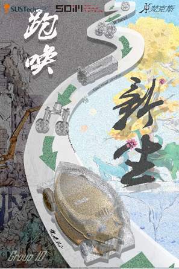

**It is final project of SDM101(Introduction to Integrated System Design) in SUSTech. We were aiming to design a eco-friendly racing car using Arduino.** It is our first time to make a controllable vehicle by ourselves, so this project can give a brief introduction for student who is wants to do some Electric design for the first time.  

 

The vehicle is controlled by Arduino. Code is under `src` folder, and the design of vehicle is in `Final Report & Experience` folder.  

***I will be glad if this project can be helpful to you.***
